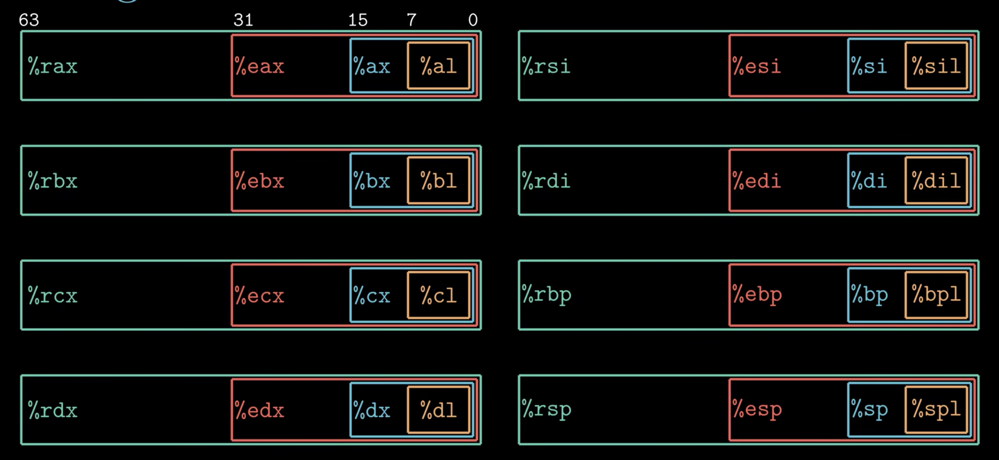
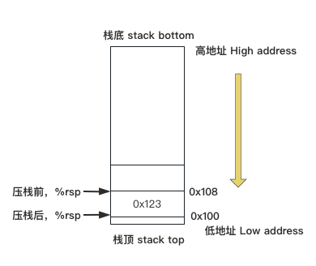

- [寄存器](#寄存器)

# 寄存器



- 寄存器ax用来保存函数的返回值
- 寄存器sp 用来保存程序栈的结束位置
- 寄存器cx、dx、si、di、r8、r9可以用来传递函数参数
- 调用者保存寄存器：bx,bp,r12,r13,r14,r15
- 被调用者保存寄存器：di,si,dx,cx,r8,r9,ax,r10,r11


| 操作码 | 操作数      |          |
| ------ | ----------- | -------- |
| movq   | (%rdi),%rax | 内存引用 |
| addq   | $8,%rsx     | 立即数   |
| Subq   | %rdi,%rax   | 寄存器   |
| Ret    |             |          |

立即数 + 基址寄存器 + 变址寄存器 * 比例因子(1,2,4,8)


## mov指令

mov指令 把数据从源位置 复制到 目的位置

Mov 源操作数[立即数|寄存器|内存引用]  目的操作数[寄存器|内存引用]

注意：

​		内存 ——> 内存：

​				mov memory, register

​				mov register, memory

- movb      ------> Move byte（1byte）

- movw     ------> Move word（2byte）

- movl       ------> Move double word（4byte）

- movq      ------> Move quad word（8byte）


## 标志

- CF  ——> 进位标志(Carry Flag)
- ZF  ——> 零标志(Zero Flag)
- SF  ——> 符号标志(Sign Flag)
- OF  ——> 溢出标志(Overflow Flag)，针对有符号数


## 栈 Stack



```
%rax  0x123

pushq %rax 

subq %8,%rsp

movq %rax,(%rsp)
```

压栈前，栈顶指针rsp指向栈顶的位置，即内存地址0x108

压栈时，寄存器rsp的值减8，此时内存地址为0x100

```
popq %rbx

movq  (%rsp),%rbx

addq $8, %rsp
```

pop指令是通过修改栈顶指针所指向的内存地址来实现数据删除的，此时内存地址0x100里保存的0x123仍然存在，下次push操作时覆盖此处保存的数值
